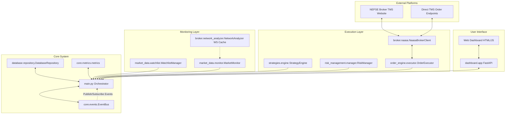

# NEPSE IPO Upper-Circuit Trading Bot - Architectural & Operational Reference (The Brain)

This document serves as the comprehensive "brain" of the **NEPSE IPO Upper-Circuit Trading Bot**. It details the architecture, module specifications, event-driven trading flows, optimization mechanics, risk management checks, database schemas, and configuration variables.

---

## 1. System Architecture & High-Level Design

The bot is designed with an **event-driven, async, concurrent, and modular architecture** powered by Python 3.12+ and `asyncio`. It coordinates browser automation (Playwright) and high-speed direct API execution.

### Architectural Diagram



### Module Overview

| Module Name | Path | Primary Responsibility |
| :--- | :--- | :--- |
| **Orchestrator** | [main.py](file:///c:/Users/Asus/Desktop/BOT/main.py) | Bootstraps systems, coordinates setup, arms IPO staging, and listens for market events. |
| **Event Bus** | [core/events.py](file:///c:/Users/Asus/Desktop/BOT/core/events.py) | An asynchronous Publish/Subscribe event bus for decoupled inter-module messaging. |
| **Broker Client** | [broker/naasa.py](file:///c:/Users/Asus/Desktop/BOT/broker/naasa.py) | Manages Playwright browser lifecycles, Keycloak authentication, page staging, and POST injection. |
| **Network Analyzer** | [broker/network_analyzer.py](file:///c:/Users/Asus/Desktop/BOT/broker/network_analyzer.py) | Intercepts, logs, and parses network frames; caches incoming SockJS WebSocket ticks. |
| **Watchlist Manager** | [market_data/watchlist.py](file:///c:/Users/Asus/Desktop/BOT/market_data/watchlist.py) | Loads, validates, updates, and saves monitored symbols from `watchlist.yaml`. |
| **Market Monitor** | [market_data/monitor.py](file:///c:/Users/Asus/Desktop/BOT/market_data/monitor.py) | Polls the TMS market watch page and feeds parsed quotes into the Strategy Engine. |
| **Strategy Engine** | [strategies/engine.py](file:///c:/Users/Asus/Desktop/BOT/strategies/engine.py) | Loads strategies from `strategies.yaml` and evaluates conditions against ticks. |
| **Risk Manager** | [risk_management/manager.py](file:///c:/Users/Asus/Desktop/BOT/risk_management/manager.py) | Validates rules (exposure, limits, kill switches, duplicate orders) before placing trades. |
| **Order Executor** | [order_engine/executor.py](file:///c:/Users/Asus/Desktop/BOT/order_engine/executor.py) | Handles pre-validation, token checks, order placement calls, and retry strategies. |
| **Database Repository**| [database/repository.py](file:///c:/Users/Asus/Desktop/BOT/database/repository.py) | Manages SQLite/PostgreSQL persistence for orders, performance metrics, and logs. |
| **Dashboard App** | [dashboard/app.py](file:///c:/Users/Asus/Desktop/BOT/dashboard/app.py) | Serves the web-based live dashboard with FastAPI and WebSocket updates. |

---

## 2. Deep Dive: The Trading Flow & Execution Path

The bot uses a specialized, two-phase trading loop specifically engineered to bypass the latency of typical browser automation.

```
                  ┌───────────────────────────────┐
                  │   Phase 1: Pre-Open Staging   │
                  │     (10:50 AM - 10:59 AM)     │
                  └───────────────┬───────────────┘
                                  │
      1. Headless login to TMS and navigate to Order page
      2. Stage Symbol, Price, and Quantity in UI
      3. Extract dynamic JS tokens (Selected_scrip, Selected_Exchange)
      4. Extract session cookies and User-Agent
                                  │
                                  ▼
                  ┌───────────────────────────────┐
                  │  Phase 2: Monitoring & Alert  │
                  └───────────────┬───────────────┘
                                  │
      Wait for live WebSocket / Market Watch quote updates
      Check condition: Is LTP inside price band?
      (LTP >= Upper Circuit Price / 1.03) OR High Limit >= Target Price
                                  │
                                  ▼ [YES]
                  ┌───────────────────────────────┐
                  │    Phase 3: Direct POST Loop  │
                  └───────────────┬───────────────┘
                                  │
      - Bypass Playwright DOM entirely!
      - Inject raw HTTP POST payload using httpx.AsyncClient connection pool
      - Constant high-frequency retries (50ms interval, up to 150 attempts)
      - Self-heal: Dynamic re-login & browser recovery (up to 3 times) with 500ms backoff
                                  │
                                  ▼ [Success]
                  ┌───────────────────────────────┐
                  │   Execution & Logging DB      │
                  └───────────────────────────────┘
```

### Phase 1: Pre-Open Staging (10:50 AM – 10:59:50 AM)
1. **Automated Login**: The bot logs in headlessly via Playwright using Keycloak selectors. Upon successful login, the browser state is saved to a persistent cookie session (`config/browser_profiles/<profile>/state.json`) to allow instant session resumption.
2. **Page Staging**: To prevent page loading delay at market open, the bot allocates a dedicated browser page/tab for each watched symbol. It clicks the buy side tab, fills the target symbol in `#searchStock`, clicks the first autocomplete dropdown list item, fills the quantity, selects the **Limit (LMT)** order type, and enters the calculated target price.
3. **Token Extraction**: Once the scrip autocomplete is selected in the DOM, the bot evaluates page JavaScript to extract crucial underlying identifiers:
   * `Selected_scrip` (The unique numeric/string ID of the scrip on NEPSE).
   * `Selected_Exchange` (NEPSE / exchange ID).
4. **Header Resolution**: It reads the active Playwright session cookies matching the `naasasecurities.com.np` domain and retrieves the browser context's `navigator.userAgent`.
5. **Session Lock**: The bot marks `staged_flag = True`, halting further browser page scans to keep the thread fully unfrozen for order submission.

### Phase 2: Preemptive Trigger Mechanism
NEPSE allows placing orders up to **3.0%** above/below the Last Traded Price (LTP). If you attempt to place a circuit order at market open when the LTP is still at the previous day's close, the TMS server will reject the order for being out of the allowed price band.

To achieve sub-millisecond execution when the band expands, the bot uses a **Dual-Check Preemptive Trigger**:
1. **In-Band Condition**: Triggers immediately when a WebSocket tick or page scrape reveals `LTP >= target_price / 1.03` (e.g. if target circuit price is Rs. 603.20, it triggers once the LTP touches Rs. 585.60).
2. **High Limit Condition**: Triggers if the broker's actual high limit on the order page updates to equal or exceed the target price.

### Phase 3: Direct POST Injection
Once triggered:
* The bot drops Playwright DOM automation entirely (which takes 200–500ms to locate elements, type, and click).
* It constructs an HTTP headers dict matching the pre-resolved `User-Agent` and session `cookies`.
* It builds a JSON payload matching the NEPSE order structure:
  ```json
  {
      "TradingAccount": "CNC",
      "Exchange": "NEPSE",
      "Scrip": "1389",
      "Quantity": "10",
      "Price": "603.2",
      "Market": "0",
      "OrderTerms": "DAY",
      "BuySellIndicator": "B",
      "BuySellType": "Buy",
      "DeliveryTerms": "D",
      "MarketSegment": "RL",
      "OrderCategory": "NORMAL",
      "OrderType": "NORMAL",
      "AccRefCode": "SELF",
      "isSquareOff": 0
  }
  ```
* It fires the order directly to the endpoint `https://x.naasasecurities.com.np/MarketOrder/Order` via a persistent connection pool managed by `httpx.AsyncClient`.
* **High Frequency Retry Loop**: Loops up to 150 times with a strict 50ms sleep interval until the order is accepted.
* **Self-Healing Mechanics**: If the API returns errors indicating session expiry, authorization failures, HTTP redirects (status `302`), or browser/page issues, the loop catches this and triggers an active recovery (up to 3 times per loop). It marks the session logged out, calls the automated broker login routine to re-authenticate (and re-initialize the browser if crashed), extracts new cookies, and resumes the HTTP POST loop.
* **Smart Backoff**: Applies a `500ms` backoff sleep on healing attempts instead of the default `50ms` to give the browser time to complete re-authentication without overloading the network socket.

---

## 3. Math & Circuit Pricing Logic

For any enabled watchlist symbol, the bot computes the daily upper circuit target price at startup.

### NEPSE Circuit & Band Rules
1. **Daily Circuit Limit**: Set to **15.0%** (regulated by NEPSE since April 20, 2026).
2. **Price Tick Size**: Orders must be placed in increments of **Rs. 0.1**.
3. **Calculation Formula**:
   $$\text{Target Price} = \text{floor}\left( \text{Previous Close} \times 1.15 \times 10 \right) \div 10$$
   *Example*:
   * Previous Close = `524.60`
   * Raw Upper Circuit Price = `524.6 * 1.15 = 603.29`
   * Target Price = `floor(6032.9) / 10 = 603.20`
4. **Preemptive Band Price**:
   $$\text{Trigger Price} = \frac{\text{Target Price}}{1.03}$$
   *Example*: `603.2 / 1.03 = 585.63` $\rightarrow$ trigger at **585.6**.

---

## 4. Risk Management Rules

Every order passes through the **Risk Manager** ([risk_management/manager.py](file:///c:/Users/Asus/Desktop/BOT/risk_management/manager.py)) validation chain before submission.

* **Kill Switch**: If `risk_kill_switch` is `true`, all orders are blocked immediately. The bot has a dual check on the YAML configuration key and the in-memory state. Additionally, the risk manager will automatically activate the kill switch if a permanent broker rejection is detected (e.g. margin short, invalid collateral, limit exceeded, client not found). Browser-level or network-level errors (e.g. browser context closed, page evaluation failure) are excluded from permanent rejection detection to prevent false-positive shutdowns.
* **Daily Capital Limit**: Caps the total monetary exposure of orders placed in a single day (default: NPR 50,000).
* **Max Quantity Per Order**: Prevents placing fat-finger orders by capping the share count per transaction (default: 10 shares for IPOs).
* **Max Exposure**: Cops total cumulative holdings exposure.
* **Max Orders Per Symbol**: Limit order spamming by locking a symbol if it hits `max_orders_per_symbol_per_day` (default: 3 orders).
* **Duplicate Window**: Prevents double-submissions by enforcing a cooldown window (default: 30 seconds) between identical orders.

---

## 5. DB Schema & Persistence Model

The bot persists its operations in a local SQLite database at `data/nepse_bot.db`.

### Core Tables

1. **`orders`**: Stores every staged, executed, or failed order.
   * `id` (UUID, Primary Key)
   * `symbol` (e.g. `TPKHL`)
   * `side` (`buy` / `sell`)
   * `price` (e.g. `603.2`)
   * `quantity` (e.g. `10`)
   * `status` (`pending`, `submitted`, `executed`, `rejected`, `failed`)
   * `broker_order_id` (The reference transaction code from TMS)
   * `error_message` (Detailed failure log)
   * `latency_ms` (Time from strategy trigger to order success confirmation)
   * `executed_at` (Timestamp of order execution)

2. **`performance_metrics`**: Records latency timings with microsecond precision.
   * `metric_name` (`detection_latency`, `decision_latency`, `submission_latency`)
   * `latency_ms` (Timing in milliseconds)
   * `symbol` (The stock symbol)
   * `recorded_at` (Timestamp)

3. **`system_events`**: Detailed operational audit logs.
   * `event_type` (`LOGIN_SUCCESS`, `CAPTCHA_DETECTED`, `SYSTEM_ERROR`)
   * `source` (Module identifier)
   * `message` (Description)

---

## 6. Live Dashboard Web UI

The dashboard runs on FastAPI and uses a WebSockets connection to stream real-time updates.

* **Location**: [dashboard/static/index.html](file:///c:/Users/Asus/Desktop/BOT/dashboard/static/index.html)
* **Configuration**: Runs on `http://localhost:8080` (unless configured otherwise in settings).
* **Features**:
  * Real-time portfolio exposure charts.
  * Active watchlist symbols list with calculated target and trigger prices.
  * Live-updating connection log and system events.
  * Interactive "Kill Switch" toggle to freeze order placing.
  * Live latency graphs depicting order decision and execution speed.

---

## 7. Pre-Trade Checklist (Tomorrows' Trade Preparation)

Follow these steps daily before NEPSE opens to ensure the bot operates flawlessly:

1. **Check Credentials**:
   Verify that `BROKER_USERNAME` and `BROKER_PASSWORD` in the `.env` file match your live login credentials.
2. **Update Previous Close**:
   Open [watchlist.yaml](file:///c:/Users/Asus/Desktop/BOT/config/watchlist.yaml) and update the `prev_close` value with the official closing price from the previous session (available on the NEPSE website or Merolagani).
3. **Verify Settings**:
   Check that `risk_kill_switch` is set to `false` in `.env` and `settings.yaml` to ensure real trades are allowed to be sent.
4. **Boot the System**:
   Run the bot:
   ```bash
   python main.py
   ```
5. **Dashboard Inspection**:
   Navigate to `http://localhost:8080` and verify:
   * The status reads "System Connected".
   * The watchlist contains your target symbol with the correct calculated target price.
   * There are no warning or login failure events.
